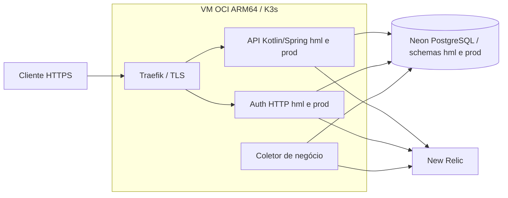

# Oficina - Fase 3

## Por que trocamos AWS por Oracle?

**A troca foi motivada por custo e continuidade da aplicação.** Depois da demonstração na AWS, a conta foi encerrada para evitar custos recorrentes de EKS, máquinas, RDS e rede. Aproveitamos a VM Oracle já disponível, com 2 OCPUs e 12 GB, para manter a API acessível usando K3s. O PostgreSQL foi mantido no Neon para não disputar os recursos dessa VM com a aplicação, e a observabilidade ficou no New Relic.

**Hoje: Oracle Cloud (VM + K3s) + Neon PostgreSQL + New Relic.** A implementação AWS permanece como histórico técnico; ela não é o ambiente ativo. A mudança preservou a engine do banco, os contratos da API e a lógica de negócio. Em troca do menor custo operacional pretendido, assumimos a manutenção de um cluster de nó único e a dependência de serviços em provedores diferentes.

Esta página da `main` apresenta a documentação atualizada. O código da adaptação OCI e seus scripts estão na [branch develop](https://github.com/DevEgF/soat-oficina-app/tree/develop); os diretórios AWS preservados na main não representam um novo deploy. Esta atualização altera apenas documentação.

## Implantação atual e decisões da solução

Atualizado em 13/09/2026 (horário de São Paulo). A solução opera na **Oracle Cloud Infrastructure (OCI), com K3s e PostgreSQL gerenciado no Neon**. A implementação AWS foi executada na etapa anterior e permanece versionada para rastreabilidade. A conta AWS foi encerrada pelo responsável para evitar custos recorrentes; os workflows de deploy AWS permanecem desabilitados. CI de qualidade não é sinônimo de deploy habilitado.

### Por que saímos da AWS e fomos para a Oracle?

A AWS foi escolhida pela familiaridade da equipe e integração entre API Gateway, Lambda, EKS, ECR, RDS, IAM, Secrets Manager e CloudWatch. Essa arquitetura atendia à composição da Fase 3, mas manter control plane, compute, banco e rede gerenciados consumia o orçamento acadêmico mesmo com poucas requisições. Créditos promocionais e alertas de orçamento não eliminam cobranças nem funcionam como bloqueio de gastos.

Após a demonstração AWS, a decisão foi encerrar a conta e aproveitar a VM OCI disponível, com **2 OCPUs, 12 GB de memória e arquitetura ARM64**, para manter a aplicação acessível. O K3s concentra os workloads nessa VM; o Neon mantém o banco fora dela; o New Relic recebe a observabilidade. A mudança foi motivada por continuidade e custo operacional, não por uma falha funcional do PostgreSQL, do EKS ou da AWS. Não há benchmark que demonstre superioridade da Oracle nem promessa de custo zero permanente: franquias, disponibilidade, armazenamento e tráfego dependem das contas e do consumo.

O compromisso aceito é operar um cluster de nó único, administrado pela equipe, e integrar serviços de provedores diferentes. K3s não é OKE/EKS gerenciado; o adaptador HTTP de autenticação não é Lambda/OCI Functions. O código e as evidências AWS continuam relevantes para requisitos específicos de Kubernetes gerenciado e serverless.

### RFCs e evolução das decisões

| Decisão | Histórico | Decisão em operação e consequência |
|---|---|---|
| RFC-0001: nuvem | A proposta inicial considerou GCP; a revisão aceita implementou AWS | Continuação em OCI/K3s após encerramento da conta AWS; mantém containers e contratos, assume operação do nó |
| RFC-0002: banco | PostgreSQL local; proposta Cloud SQL; implementação RDS PostgreSQL 16 | Neon PostgreSQL 16, preservando modelo relacional, JPA e Flyway |
| RFC-0003: autenticação | Proposta anterior com JWKS/OTP; implementação acadêmica CPF + JWT HS256 | Mesmo contrato no adaptador HTTP OCI; OTP e JWKS não são funcionalidades entregues |
| Ambientes | Uma infraestrutura compartilhada para reduzir custo | Namespaces e schemas hml/prod separados, sem isolamento físico nem HA entre nós |
| Segredos OCI | AWS usava Secrets Manager e identidades de workload | Exceção autorizada: arquivos protegidos na VM e Kubernetes Secrets; valores fora do Git e dos logs |
| Entrega OCI | AWS mantém seus workflows e promoção por artefato | Deploy via SSH/Helm, ARM64 por digest; registry e pipeline OCI completos ainda não foram executados |

As RFCs versionadas registram agora a continuação OCI e preservam a decisão AWS anterior em seção histórica. Consulte as [RFCs e o contexto completo da aplicação](https://github.com/DevEgF/soat-oficina-app/blob/develop/README.md#rfcs-e-documentação-de-referência).

### Por que PostgreSQL e por que Neon?

O domínio relaciona clientes, veículos, ordens de serviço, serviços, peças e reservas. Transações, chaves estrangeiras, unicidade e consultas relacionais sustentam a consistência de estoque, orçamento e andamento da OS. PostgreSQL preserva as migrations existentes, os tipos temporais, valores monetários em centavos e a integração JPA/Hibernate. Trocar para MySQL exigiria revalidar DDL e semântica temporal; SQL Server acrescentaria mudança de dialeto/licenciamento; uma base documental exigiria remodelar relações sem uma necessidade demonstrada. Essas alternativas não traziam benefício suficiente para justificar a migração de engine.

Neon foi adotado como **serviço PostgreSQL gerenciado externo**, evitando disputar memória, disco e recuperação do banco com os containers na VM pequena. O projeto `oficina` fica em Ohio (`us-east-2`), enquanto a VM OCI fica em Ashburn (`us-ashburn-1`): há dependência de internet e latência entre regiões/provedores. A conexão direta, sem pooler, usa TLS com verificação de certificado; sete migrations Flyway foram aplicadas em cada schema. O banco operacional é `neondb`, com schemas `hml` e `prod`.

Os ambientes compartilham o proprietário do banco: schemas oferecem separação lógica, **não isolamento de privilégios**. Papéis dedicados, restauração ensaiada, capacidade de conexões e política de backup/retenção precisam ser tratados antes de ampliar o uso. Não se afirma aqui que o projeto Neon foi provisionado por Terraform: o módulo IaC de banco preservado é o RDS. Credenciais S3 ou AI Gateway do Neon não substituem credenciais PostgreSQL.

### Repositórios e responsabilidades

| Repositório | Responsabilidade |
|---|---|
| [soat-oficina-app](https://github.com/DevEgF/soat-oficina-app) | Kotlin/Spring, domínio e API, frontend React, Flyway, charts AWS/OCI, smoke e telemetria de negócio |
| [soat-oficina-auth](https://github.com/DevEgF/soat-oficina-auth) | Autenticação de cliente, JWT, handlers Lambda e adaptador HTTP OCI |
| [soat-oficina-infra-k8s](https://github.com/DevEgF/soat-oficina-infra-k8s) | Fundação Terraform AWS e bootstrap da VM/K3s OCI |
| [soat-oficina-infra-db](https://github.com/DevEgF/soat-oficina-infra-db) | Terraform RDS, rede, criptografia e lifecycle do banco AWS preservado |

### Evidências, observabilidade e vídeo

- [Saúde HML](https://hml.129.213.121.122.sslip.io/actuator/health) e [saúde PROD](https://oficina.129.213.121.122.sslip.io/actuator/health): HTTPS validado com certificado Let's Encrypt; endereço gratuito baseado no IP via sslip.io.
- [Dashboard HML](https://one.newrelic.com/dashboards/detail/ODQzOTI5M3xWSVp8REFTSEJPQVJEfGRhOjEzMTY1MzA5?account=8439293) e [dashboard PROD](https://one.newrelic.com/dashboards/detail/ODQzOTI5M3xWSVp8REFTSEJPQVJEfGRhOjEzMTY1MzEw?account=8439293): negócio, API/auth e Kubernetes. São privados e exigem acesso à conta New Relic.
- [Alertas New Relic](https://one.newrelic.com/alerts?account=8439293&duration=259200000): o ensaio HML enviou 80 chamadas controladas, 40 respostas 400 e 40 respostas 401, e confirmou dois incidentes críticos. São rejeições de autenticação, não erros internos 5xx; consultar também incidentes fechados e o período de 12/09/2026, 23h15 BRT, se não estiverem ativos.
- Jornada HML verificada até OS entregue, autorização por proprietário, bloqueio de acesso administrativo por cliente e rejeição de JWT entre ambientes. Produção foi validada com saúde, login e leitura, sem criar OS de teste.
- Rollback OCI verificado com mudança de configuração Helm, preservando a OS e os mesmos digests. Não equivale a rollback de binário ou reversão de migrations.
- **Vídeo: gravado com todos os requisitos, conforme confirmação do responsável.** [Assistir à demonstração](https://drive.google.com/file/d/1OGqlACabTZnHzdbG0k2q0ttf29OQkWOF/view?usp=sharing). O link foi fornecido pelo responsável; esta atualização não afirma revisão independente do conteúdo nem da duração.

As evidências descrevem o ensaio realizado, não uma garantia de disponibilidade contínua. Não foi comprovada entrega de notificações por e-mail/Slack. A instalação OCI não inclui publicação do frontend, registry remoto ou pipeline completa de promoção OCI. Essas diferenças técnicas permanecem explícitas mesmo com o vídeo concluído.

## Guia específico deste repositório

Aplicação Kotlin/Spring Boot com PostgreSQL e frontend React. A arquitetura AWS preservada se divide em quatro repositórios: aplicação, autenticação Lambda, fundação EKS e banco RDS. O código desta fase substitui as rotas públicas de acompanhamento por autenticação de cliente com CPF e JWT vinculado ao UUID do cliente.

## Execução local

Java 17 e PostgreSQL 16 são necessários. O perfil `local` habilita exclusivamente credenciais sintéticas de desenvolvimento:

```powershell
$env:SPRING_PROFILES_ACTIVE='local'
./oficina/gradlew -p oficina bootRun
```

Configure `SPRING_DATASOURCE_URL`, `SPRING_DATASOURCE_USERNAME` e `SPRING_DATASOURCE_PASSWORD` para seu banco local. O frontend usa `npm ci` e `npm run dev` em `frontend/`; veja [a configuração dos dois clientes HTTP](https://github.com/DevEgF/soat-oficina-app/blob/develop/frontend/README.md). A autenticação de cliente fica no repositório `soat-oficina-auth` (Lambda na AWS ou adaptador HTTP na OCI); não existe `/auth/token` no processo Spring local.

Credenciais padrão são permitidas apenas quando todos os perfis ativos são `local` ou `test`. O ambiente implantado usa o perfil `docker`, exige JWT e as cinco senhas staff externas e rejeita padrões conhecidos, inclusive em combinações `docker,test`. Os usuários são `master`, `admin`, `atendente`, `tecnico` e `almoxarife`; senhas de AWS nunca ficam no repositório.

## API

- `POST /auth/token` no API Gateway AWS ou no adaptador HTTP atrás do Traefik OCI: corpo `{ "cpf": "..." }`, cliente ACTIVE, JWT de 900 segundos. BLOCKED e CPF inexistente têm a mesma resposta 401; CPF inválido retorna 400.
- `GET /api/customer/os/acompanhar?codigo=...`: Bearer CUSTOMER; propriedade validada pelo UUID de `sub`.
- `POST /api/customer/os/aprovar-orcamento?codigo=...` e `/reprovar-orcamento?codigo=...`: mesmo Bearer e propriedade.
- `POST /api/customer/os/orcamento/decisao`: `{ "codigo": "...", "decisao": "APROVADO" | "RECUSADO" }` com Bearer CUSTOMER.
- `POST /api/public/auth/login`: login staff. `/api/admin/**`, `/api/attendant/**`, `/api/technician/**` e `/api/warehouse/**` exigem o escopo correspondente.
- `/actuator/health`, `/actuator/health/readiness` e `/actuator/health/liveness`: probes; documentação local em `/swagger-ui.html` e `/v3/api-docs`.

CPF só é credencial de entrada da Lambda; não é prova forte de identidade e não deve ser tratado como solução de autenticação para um produto público. A limitação acadêmica está registrada na [RFC de autenticação](https://github.com/DevEgF/soat-oficina-app/blob/develop/docs/rfcs/0003-estrategia-de-autenticacao.md). Tokens levam `iss=oficina`, `aud=oficina-api`, `env=hml|prod`, `scope=CUSTOMER`, `sub=UUID`, `iat` e `exp`; assinatura HS256 usa SHA-256 dos bytes UTF-8 exatos da chave compartilhada.

## Entrega e validação

Os checks obrigatórios são `app / backend`, `app / image`, `app / helm-smoke` e `app / security`. Executam backend/JaCoCo, frontend lint/test/build, Docker, Trivy, validação Helm e instalação kind. Na implementação AWS, o workflow de deploy de `develop` publica a imagem testada em ECR e implanta hml quando habilitado. Atualmente esse workflow está desabilitado. `main` promove exatamente o digest atestado por uma implantação hml bem-sucedida; a entrega prod não reconstrói nem publica imagem.

O [chart Helm](https://github.com/DevEgF/soat-oficina-app/blob/develop/deploy/helm/oficina/README.md) executa Flyway em Job antes do runtime, usa TLS verify-full e configurações por revisão. Falhas de smoke externo provocam rollback explícito. Migrações devem continuar compatíveis com a versão anterior; rollback não desfaz dados. Remoção e rollback são workflows manuais, separados por ambiente; remoção exige `DESTROY-soat-oficina-app` e preserva cluster, namespaces e banco.

```powershell
./oficina/gradlew -p oficina --no-daemon clean check bootJar
npm --prefix frontend ci
npm --prefix frontend run lint
npm --prefix frontend test
npm --prefix frontend run build
python deploy/helm/oficina/tests/render.py
pwsh -File scripts/test-workflows.ps1
pwsh -File scripts/test-delivery.ps1
pwsh -File scripts/test-evidence.ps1
```

Os scripts Python de verificação usam PyYAML. Testes de integração usam somente banco PostgreSQL descartável. O build Docker também executa os testes e precisa alcançar esse banco através de `BUILD_TEST_DATASOURCE_URL`.

## RFCs e documentação de referência

- [Componentes](https://github.com/DevEgF/soat-oficina-app/blob/develop/docs/architecture/componentes.md), [autenticação](https://github.com/DevEgF/soat-oficina-app/blob/develop/docs/architecture/sequencia-auth.md) e [jornada da OS](https://github.com/DevEgF/soat-oficina-app/blob/develop/docs/architecture/sequencia-os.md).
- [Contratos entre repositórios](https://github.com/DevEgF/soat-oficina-app/blob/develop/docs/architecture/integration-contracts.md).
- [Ambientes compartilhados](https://github.com/DevEgF/soat-oficina-app/blob/develop/docs/adrs/0001-ambientes-compartilhados.md).
- [Coleção Postman](https://github.com/DevEgF/soat-oficina-app/blob/develop/postman/Fase3.postman_collection.json) e [ambiente sem credenciais](https://github.com/DevEgF/soat-oficina-app/blob/develop/postman/hml.postman_environment.json).
- [Roteiro e evidências de aceite](https://github.com/DevEgF/soat-oficina-app/blob/develop/docs/acceptance.md).
- [Checklist consolidado da entrega](https://github.com/DevEgF/soat-oficina-app/blob/develop/docs/delivery/fase-3-checklist.md) e [roteiro do vídeo](https://github.com/DevEgF/soat-oficina-app/blob/develop/docs/delivery/video-script.md).

### Arquitetura em execução



A aplicação mantém domínio, casos de uso, adaptadores de persistência e controllers separados. O Spring valida o JWT e a propriedade da OS; a borda HTTPS não substitui autorização. Flyway executa antes do rollout e Hibernate valida o schema, sem executar migrações em cada réplica.

- [RFC-0001: escolha da nuvem](https://github.com/DevEgF/soat-oficina-app/blob/develop/docs/rfcs/0001-escolha-da-nuvem.md).
- [RFC-0002: banco gerenciado](https://github.com/DevEgF/soat-oficina-app/blob/develop/docs/rfcs/0002-escolha-do-banco-de-dados.md).
- [RFC-0003: autenticação](https://github.com/DevEgF/soat-oficina-app/blob/develop/docs/rfcs/0003-estrategia-de-autenticacao.md).
- [Operação OCI, HTTPS, telemetria e reprodução dos testes](https://github.com/DevEgF/soat-oficina-app/blob/develop/deploy/oci/README.md).
- [Ambiente kind local](https://github.com/DevEgF/soat-oficina-app/blob/develop/infra/README.md), [manifestos locais](https://github.com/DevEgF/soat-oficina-app/blob/develop/k8s/README.md) e [chart AWS preservado](https://github.com/DevEgF/soat-oficina-app/blob/develop/deploy/helm/oficina/README.md).

Os documentos históricos da pasta docs podem retratar a entrega AWS ou planejamentos anteriores; o estado OCI e o vídeo atualizado estão registrados neste README e no guia OCI.
