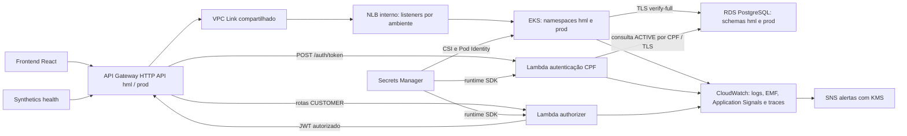

# Componentes da Fase 3

A API de staff autentica por usuário/senha no Spring; rotas de cliente passam pelo authorizer e pelo decoder Spring. A autorização de propriedade da OS pertence à aplicação, usando `sub=UUID`. Nenhum consumidor recebe credenciais via Terraform output; apenas ARNs de recursos atravessam repositórios. Os serviços compartilhados reduzem custo da demonstração, conforme [ADR](../adrs/0001-ambientes-compartilhados.md).
