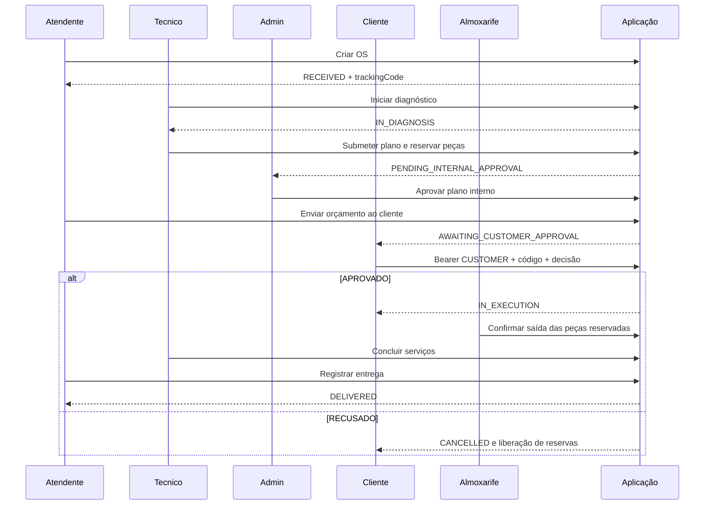

# Jornada da ordem de serviço

A aplicação mede criação, duração das etapas DIAGNOSIS/APPROVAL/EXECUTION e falhas inesperadas por operação. Status e operações usam listas fechadas; CPF, UUID, placa, código de OS e correlation ID não são dimensões de métricas. Rejeição interna também cancela a OS e libera as reservas aplicáveis.
