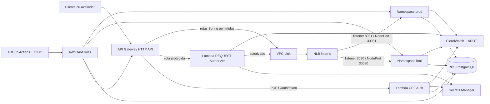
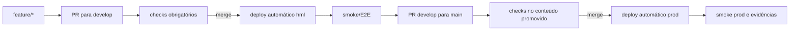

# Fase 3 — Arquitetura AWS e desenho da entrega

- **Status:** aprovado para planejamento
- **Data da decisão:** 31/08/2026
- **Prazo da entrega:** 15/09/2026
- **Responsável:** um integrante, com disponibilidade de 2 horas por dia (30 horas)
- **Região AWS:** `us-east-1`
- **Fonte principal:** `C:\Users\egito\Downloads\13SOAT - Fase 3 - Tech Challenge.pdf`

## 1. Resumo executivo

A Fase 3 será entregue em AWS com uma arquitetura pequena, reproduzível por Terraform e criada apenas durante integração, demonstração e gravação. O objetivo é cumprir integralmente os itens avaliados sem transformar um projeto acadêmico de 30 horas em uma plataforma de produção.

A solução usa:

- Amazon API Gateway HTTP API como entrada pública;
- AWS Lambda para autenticação de cliente por CPF e para autorização JWT;
- Amazon EKS para a aplicação Kotlin/Spring;
- Amazon RDS for PostgreSQL como banco gerenciado;
- Amazon CloudWatch, AWS Distro for OpenTelemetry (ADOT) e Application Signals para observabilidade;
- AWS Secrets Manager para credenciais e segredo JWT;
- GitHub Actions autenticado na AWS por OIDC, sem access keys permanentes;
- quatro repositórios independentes, conforme exigido pelo desafio.

Homologação e produção compartilharão os recursos caros: um cluster EKS, um nó EC2, um RDS e um NLB interno. O isolamento será lógico, usando namespaces Kubernetes, schemas PostgreSQL, funções/stages e configuração próprios por ambiente. Essa é uma decisão acadêmica e econômica, não uma recomendação para uma produção real.

## 2. Objetivos

1. Entregar os quatro repositórios exigidos, cada um com CI/CD independente.
2. Publicar endpoints de homologação e produção pelo API Gateway.
3. Autenticar o cliente por CPF, validar existência e status no banco e emitir JWT.
4. Proteger as APIs sensíveis e demonstrar rejeição de acesso sem token válido.
5. Executar a aplicação em Kubernetes escalável no EKS.
6. Usar PostgreSQL gerenciado e versionado com Flyway.
7. Demonstrar logs estruturados, correlação, métricas, traces, dashboard e alertas ao vivo.
8. Produzir a documentação, os diagramas e o vídeo de até 15 minutos exigidos.
9. Limitar o consumo previsto do crédito AWS a US$ 20.
10. Destruir os recursos cobrados após a entrega, preservando somente evidências e, temporariamente, o state remoto.

## 3. Fora do escopo

Para preservar o prazo, não serão implementados nesta fase:

- OTP, senha ou prova forte de identidade do cliente;
- Datadog, New Relic ou outro APM externo;
- Multi-AZ no RDS;
- dois clusters EKS ou duas instâncias RDS;
- NAT Gateway;
- domínio próprio e certificado personalizado;
- redesenho visual do frontend;
- isolamento físico entre homologação e produção;
- usuários PostgreSQL individuais para cada workload;
- instrumentação dinâmica e captura de cada função Java;
- dados pessoais reais.

## 4. Rastreabilidade dos requisitos

| Requisito da Fase 3 | Decisão de desenho |
|---|---|
| API Gateway | HTTP API pública, com integrações Lambda e integração privada via VPC Link |
| Autenticação por CPF | Lambda valida CPF, consulta cliente ativo e emite JWT curto |
| Rotas sensíveis protegidas | Lambda authorizer no Gateway e validação repetida no Spring Security |
| Função serverless | Repositório exclusivo `soat-oficina-auth` |
| Infra Kubernetes em Terraform | Repositório `soat-oficina-infra-k8s` |
| Banco gerenciado em Terraform | Repositório `soat-oficina-infra-db` |
| Aplicação principal em Kubernetes | Repositório `soat-oficina-app` |
| CI/CD independente | GitHub Actions em cada repositório, com PR, `develop` e `main` |
| Homologação e produção | Namespaces, schemas, stages e funções separados sobre recursos compartilhados |
| Escalabilidade | HPA de 1 a 3 pods, Metrics Server e node group gerenciado |
| Monitoramento | CloudWatch dashboard, Application Signals, ADOT, alarmes e Synthetics |
| Logs JSON e correlação | `requestId` propagado do Gateway às Lambdas e ao Spring via MDC |
| Métricas de negócio | volume diário de OS, tempo por status e falhas de processamento |
| Documentação | diagramas, sequências, RFCs, ADRs, ER, OpenAPI/Postman e READMEs |
| Vídeo | roteiro de no máximo 15 minutos cobrindo pipeline, auth, APIs e observabilidade |

## 5. Arquitetura lógica

### 5.1 Entrada e roteamento

Serão expostos endpoints HTTP API distintos para `hml` e `prod`. Ambos usarão o mesmo VPC Link e o mesmo NLB interno. O NLB terá um listener e target group por ambiente: porta 8080 para o Service NodePort 30080 de `hml` e porta 8081 para o NodePort 30081 de `prod`. Assim, o Gateway escolhe o ambiente pelo listener da integração, sem ingress controller adicional.

Rotas mínimas:

| Rota | Proteção | Destino |
|---|---|---|
| `POST /auth/token` | throttling, sem JWT | Lambda de autenticação por CPF |
| `/api/customer/**` | JWT com `SCOPE_CUSTOMER` | aplicação Spring no EKS |
| `/api/staff/**` | JWT de funcionário validado pelo Spring | aplicação Spring no EKS |
| `POST /api/public/auth/login` | throttling, sem JWT | login de funcionário existente |
| `/actuator/health` | leitura pública limitada | health da aplicação |

Não haverá rota curinga pública para toda a aplicação. As rotas legadas que permitem acompanhar OS ou decidir orçamento sem autenticação serão removidas ou movidas para `/api/customer/**`.

### 5.2 Rede

- VPC em duas Availability Zones.
- Subnets públicas para o node group EKS, com IPv4 público e sem regras de entrada abertas para os nós.
- Subnets privadas para RDS e Lambdas.
- NLB interno, acessível pelo API Gateway por VPC Link.
- RDS aceita PostgreSQL somente dos security groups do EKS e das Lambdas autorizadas.
- Interface VPC endpoint para Secrets Manager, pois as Lambdas privadas não usarão NAT Gateway.
- Endpoint público da API do EKS protegido por IAM e EKS access entries; não expõe os workloads.
- Sem acesso público ao RDS.

## 6. Autenticação e autorização

### 6.1 Fluxo do cliente

1. Cliente chama `POST /auth/token` com `{ "cpf": "..." }`.
2. API Gateway aplica throttling e invoca a Lambda do ambiente.
3. A Lambda remove formatação e valida os dígitos verificadores do CPF.
4. A Lambda executa query parametrizada no schema permitido pelo ambiente.
5. Apenas um cliente existente com `status = 'ACTIVE'` é aceito.
6. A Lambda emite JWT HS256 curto contendo:
   - `sub`: UUID interno do cliente;
   - `scope`: `CUSTOMER`;
   - `iss`: `oficina`;
   - `iat` e `exp`;
   - nenhum CPF ou outro dado pessoal.
7. O authorizer valida assinatura, emissor, expiração e escopo.
8. O Spring Security valida novamente o JWT antes de executar a operação.

### 6.2 Respostas

| Situação | Status |
|---|---:|
| CPF malformado | `400` |
| Cliente inexistente, bloqueado ou JWT inválido | `401` |
| Escopo insuficiente | `403` |
| Limite de requisições excedido | `429` |
| RDS ou dependência indisponível | `503` |

Cliente inexistente e bloqueado retornam a mesma resposta. Logs nunca contêm CPF completo, token ou credenciais.

### 6.3 Limitação conhecida

CPF não é segredo e não comprova identidade. O fluxo atende literalmente ao enunciado acadêmico, mas não será apresentado como autenticação adequada para produção. OTP por e-mail é a evolução recomendada.

## 7. Dados e migrações

### 7.1 RDS

- PostgreSQL em `db.t4g.micro`, Single-AZ.
- 20 GB gp3.
- Criptografia em repouso com chave gerenciada pela AWS.
- TLS obrigatório para conexões.
- Retenção de backup automatizado de 1 dia, suficiente para a janela acadêmica.
- Sem deletion protection e sem snapshot final, porque serão usados somente dados sintéticos.

### 7.2 Separação de ambientes

Uma instância e um database lógico conterão:

- schema `hml` e sua `flyway_schema_history`;
- schema `prod` e sua `flyway_schema_history`.

`DB_SCHEMA` será uma variável controlada pela implantação. O valor nunca será aceito de entrada do usuário e será validado contra a lista `hml|prod`.

A credencial gerenciada do RDS ficará no Secrets Manager e será consumida pelos workloads autorizados. Compartilhar essa credencial é um compromisso consciente para cumprir prazo e custo; usuários PostgreSQL por serviço ficam como melhoria pós-entrega.

### 7.3 Flyway

- A migration `V7` adicionará `clientes.status` com `NOT NULL`, padrão `ACTIVE` e valores aceitos `ACTIVE|BLOCKED`.
- As migrations serão executadas por um Job antes do rollout.
- O Job usará a mesma imagem imutável que será implantada.
- O rollout não começa se a migration falhar.
- Toda migration desta fase deve ser aditiva e compatível com a versão anterior do app.
- Não será feito rollback destrutivo de banco; código volta para a imagem anterior e o banco permanece compatível.

## 8. Repositórios e responsabilidades

### 8.1 `soat-oficina-infra-k8s`

Responsável por:

- bootstrap do state remoto S3;
- provedor OIDC do GitHub e roles IAM de pipeline;
- VPC, subnets, rotas, security groups e endpoints necessários;
- EKS, managed node group `t3.medium` e access entries;
- ECR;
- NLB interno compartilhado, dois listeners, dois target groups e attachments ao node group;
- EKS add-ons: Metrics Server e CloudWatch Observability;
- permissões mínimas para CloudWatch, X-Ray e acesso a secrets;
- dashboards, alarmes técnicos e SNS compartilhados;
- outputs consumidos pelos outros repositórios.

### 8.2 `soat-oficina-infra-db`

Responsável por:

- RDS PostgreSQL;
- subnet group, security group e parâmetros TLS;
- armazenamento, criptografia e backup;
- segredo gerenciado;
- alarmes técnicos do banco;
- outputs não sensíveis e documentação ER/decisões do banco.

### 8.3 `soat-oficina-auth`

Responsável por:

- Lambda de autenticação CPF/JWT;
- Lambda authorizer;
- API Gateway HTTP API, stages e rotas;
- VPC Link e integrações privadas;
- throttling e reserved concurrency;
- testes de CPF, status do cliente, claims JWT e contratos HTTP;
- TypeScript em runtime Node.js 22, AWS SDK for JavaScript v3 e Powertools.

### 8.4 `soat-oficina-app`

Responsável por:

- aplicação Kotlin/Spring e frontend já existentes;
- migrations Flyway;
- Dockerfile;
- Helm chart/manifests para `hml` e `prod`;
- Services NodePort fixos: 30080 em `hml` e 30081 em `prod`;
- HPA de 1 a 3 pods;
- rotas de cliente protegidas e autorização por scope;
- logs JSON, correlação e métricas de negócio;
- OpenAPI/Postman, testes e documentação funcional.

### 8.5 Ordem de construção

1. `infra-k8s`;
2. `infra-db`;
3. `app`, que publica o serviço interno no EKS;
4. `auth`, que conecta o Gateway ao listener interno.

## 9. CI/CD

### 9.1 Branches

Todos os repositórios usarão:

- `feature/*` para trabalho;
- `develop` para homologação;
- `main` para produção.

`develop` e `main` exigirão Pull Request, checks atualizados e bem-sucedidos, sem force-push, sem exclusão e sem bypass administrativo. Como existe apenas um integrante, serão exigidas zero aprovações humanas; exigir uma revisão tornaria o merge impossível.

### 9.2 Autenticação do pipeline

- GitHub Actions solicita token OIDC com `id-token: write` apenas no job de deploy.
- IAM trust limita `sub` ao repositório e GitHub Environment esperado.
- Cada repositório/ambiente recebe role dedicada com menor privilégio.
- Não há AWS access key em GitHub Secrets.
- GitHub Environments `hml` e `prod` restringem as branches que podem implantar.
- Actions externas críticas devem ser fixadas por SHA completo.

### 9.3 Fluxo

Para a infraestrutura compartilhada, `develop` aplica o candidato na janela de homologação; `main` reaplica o mesmo conjunto de alterações promovido e executa a verificação de produção. O SHA do merge pode mudar, portanto as pipelines registram também o commit de origem e o digest da imagem. Esse compartilhamento significa que mudanças de base testadas em homologação também afetam a fundação de produção, compromisso aceito para economizar.

### 9.4 Quality gates

**Aplicação:**

- Gradle `check` e `bootJar`;
- PostgreSQL 16 real como service container;
- cobertura JaCoCo mínima de 80%;
- testes unitários, de arquitetura e integração;
- build Docker;
- scan de imagem;
- smoke local no kind antes do merge.

**Auth:**

- `npm ci`;
- lint e type-check;
- testes unitários e integração do handler;
- cobertura mínima de 80%;
- build TypeScript;
- validação da infraestrutura associada.

**Terraform:**

- `terraform fmt -check`;
- `terraform init -backend=false`;
- `terraform validate`;
- TFLint;
- Checkov;
- `terraform plan` salvo como artefato antes do apply.

**Pós-deploy:**

- `/actuator/health` retorna `UP`;
- CPF sintético ativo recebe token;
- rota protegida rejeita requisição sem token;
- token permite consultar/criar uma jornada curta de OS;
- logs e traces aparecem com o mesmo `requestId`.

### 9.5 Recuperação

- App: `helm rollback` para a revisão anterior.
- Lambda: alias volta para a versão anterior.
- Banco: migrations aditivas preservam compatibilidade; não existe down migration automática.
- Terraform: revert do commit e novo `plan/apply`; nenhum rollback destrutivo automático.
- O workflow de `destroy` é manual, protegido e executado somente com alvo/ambiente explícito.

## 10. Observabilidade

### 10.1 Coleta

- EKS add-on `amazon-cloudwatch-observability`.
- ADOT auto-instrumentation Java por annotation no pod.
- Application Signals para serviços, operações, dependências e traces.
- Metrics Server como fonte do HPA.
- Powertools Logger/Tracer/Metrics nas Lambdas.
- Logs JSON em todos os componentes.
- Retenção de logs de 7 dias.
- Sampling padrão do ADOT/X-Ray; em baixo volume, a taxa base captura a demonstração.

Não serão definidos endpoints OTLP manualmente nos pods do EKS; o add-on injeta a configuração correta.

### 10.2 Correlação e privacidade

O campo `requestId` nasce ou é preservado no API Gateway, passa pelas Lambdas em header e entra no MDC do Spring. O evento JSON inclui somente campos de baixa sensibilidade, como:

- timestamp;
- level;
- service;
- environment;
- requestId/traceId;
- route e method;
- statusCode;
- durationMs;
- eventName.

CPF, JWT, senha, segredo, corpo sensível e connection string não são registrados.

### 10.3 Métricas de negócio

Métricas EMF no namespace `Oficina`:

| Métrica | Unidade | Dimensões permitidas |
|---|---|---|
| `WorkOrdersCreated` | Count | `Environment`, `ServiceName` |
| `WorkOrderStageDurationMs` | Milliseconds | `Environment`, `Status` |
| `WorkOrderProcessingFailures` | Count | `Environment`, `Operation` |

UUID, CPF, número da OS e `requestId` nunca são dimensões, evitando cardinalidade alta e custo imprevisível.

### 10.4 Dashboard

Um dashboard por ambiente, com janela padrão de 8 horas:

1. status dos alarmes;
2. disponibilidade/health;
3. OS abertas no dia;
4. falhas de processamento;
5. requisições, 4xx e 5xx;
6. latência p50, p95 e p99;
7. CPU, memória, réplicas e estado dos pods;
8. tempo médio por status da OS;
9. erros de Lambda, duração e throttles;
10. consulta Logs Insights com os erros recentes e `requestId`.

### 10.5 Alertas

- Falha no canário/health: ausência é tratada como breaching.
- Erro de processamento de OS: ausência é tratada como not breaching.
- Latência p99 acima do limite inicial: 2 de 3 períodos de 1 minuto.

Os alertas publicam em um SNS topic com o e-mail do responsável. O canário roda a cada 15 minutos somente enquanto o ambiente estiver ativo.

## 11. Segurança

- Menor privilégio para pipeline, Lambda, authorizer e service accounts.
- GitHub OIDC no lugar de chaves permanentes.
- EKS access entries no lugar de edição manual do `aws-auth`.
- Secrets Manager no lugar de secrets em GitHub ou manifests.
- TLS no tráfego para RDS.
- Criptografia em repouso no RDS, EBS, S3 state e Secrets Manager.
- S3 state com versionamento, bloqueio de acesso público e lockfile do Terraform.
- Imagens ECR imutáveis por SHA; deploy nunca usa `latest`.
- API Gateway throttling e Lambda reserved concurrency.
- RDS privado e security groups por origem.
- Massa de dados integralmente sintética.
- Scan estático de Terraform e scan de imagens no CI.

## 12. Tratamento de falhas

- Erros HTTP seguem contrato JSON uniforme, sem stack trace para o cliente.
- Exceções inesperadas geram evento estruturado e `WorkOrderProcessingFailures` quando aplicável.
- Falha de RDS é mapeada para `503` sem expor host ou credencial.
- Timeouts e limites são explícitos no Gateway, Lambda e cliente HTTP.
- Readiness impede tráfego antes de app e banco estarem prontos.
- Liveness reinicia pods travados.
- Startup probe tolera o boot da JVM sem causar reinício prematuro.
- Falha de migration bloqueia rollout.
- Falha de smoke bloqueia promoção.
- Diagnósticos de pipeline coletam `kubectl get`, describe e logs recentes como artefatos.

## 13. Estimativa de custo e guardrails

Estimativa base atual para `us-east-1`, calculada em 31/08/2026:

| Componente | Estimativa por hora |
|---|---:|
| EKS control plane | US$ 0,100000 |
| EC2 `t3.medium` | US$ 0,041600 |
| RDS `db.t4g.micro` | US$ 0,016000 |
| NLB | US$ 0,022500 |
| 1 NLCU estimada | US$ 0,006000 |
| IPv4 público | US$ 0,005000 |
| EBS gp3 20 GB | US$ 0,002192 |
| RDS gp3 20 GB | US$ 0,003151 |
| **Total base arredondado** | **US$ 0,20/h** |

Cenários determinísticos:

- 4 horas: US$ 0,79;
- 8 horas: US$ 1,57;
- 24 horas: US$ 4,71;
- 40 horas: US$ 7,86;
- 730 horas: US$ 143,40.

API Gateway, Lambda, CloudWatch, Secrets Manager, transferência e variações de capacidade são custos variáveis não incluídos. Por isso:

- teto operacional do projeto: US$ 20;
- alertas de custo em US$ 10, US$ 15 e US$ 20;
- conferência diária durante os dias de deploy;
- recursos ligados apenas para integração, ensaio e vídeo;
- destruição na ordem `auth → app → db → k8s`;
- state S3 e roles OIDC podem permanecer até a confirmação da nota, por custo residual desprezível, e serão removidos depois com autorização explícita.

A conta tinha US$ 100 de crédito disponível e plano gratuito ativo quando esta decisão foi tomada. O crédito não justifica manter EKS continuamente ativo.

## 14. Cronograma aprovado

| Data | Horas | Resultado |
|---|---:|---|
| 01–02/09 | 4h | quatro repositórios, padrões, OIDC e state S3 |
| 03–05/09 | 6h | VPC, EKS, ECR, RDS e Secrets Manager |
| 06–07/09 | 4h | Lambda CPF/JWT, authorizer e API Gateway |
| 08–10/09 | 6h | app, Flyway, Helm e rotas protegidas |
| 11/09 | 2h | CloudWatch, logs, métricas, traces e alertas |
| 12/09 | 2h | pipelines completas e teste hml → prod |
| 13/09 | 2h | READMEs, diagramas, RFC/ADR, ER e APIs |
| 14/09 | 2h | ensaio e gravação do vídeo |
| 15/09 | 2h | contingência, portal, verificação e destroy |

O escopo está congelado. Em caso de atraso, saem primeiro melhorias cosméticas; a jornada principal, documentação exigida e evidências permanecem.

## 15. Documentação da entrega

Cada repositório conterá:

- objetivo e fronteiras;
- pré-requisitos;
- arquitetura própria;
- como testar;
- como implantar em hml/prod;
- como destruir;
- variáveis e secrets esperados, sem valores;
- URL do ambiente e link para execução da pipeline;
- troubleshooting essencial.

O conjunto da entrega conterá:

- diagrama de componentes/cloud;
- sequência de autenticação;
- sequência de abertura/acompanhamento de OS;
- ER atualizado;
- RFC de escolha da AWS;
- RFC/ADR de PostgreSQL/RDS;
- ADR da autenticação por CPF e seu risco;
- ADR de compartilhamento hml/prod;
- OpenAPI e coleção Postman;
- roteiro do vídeo;
- PDF do portal com quatro repositórios, documentação e vídeo;
- colaborador `soat-architecture` adicionado aos quatro repositórios.

Os RFCs atuais em `docs/rfcs/` que escolhem GCP/Cloud SQL entram em conflito com esta decisão. Eles deverão ser substituídos ou marcados como superseded durante a execução; não podem permanecer como decisão vigente na entrega.

## 16. Roteiro do vídeo

Tempo máximo: 15 minutos.

1. **1 min:** quatro repositórios e visão arquitetural.
2. **2 min:** PR protegido e pipeline executando.
3. **3 min:** CPF ativo recebe JWT; CPF bloqueado falha; rota sem JWT retorna 401.
4. **4 min:** jornada curta da OS na aplicação Kubernetes.
5. **3 min:** dashboard, alerta, log JSON e trace pelo `requestId`.
6. **1 min:** Terraform e ambientes hml/prod.
7. **1 min:** custos, limitações e estratégia de destroy.

## 17. Critérios de aceite

A entrega só é considerada pronta quando todos os itens abaixo forem verdadeiros:

- [ ] existem quatro repositórios acessíveis e com `soat-architecture` como colaborador;
- [ ] `develop` e `main` estão protegidas e o merge ocorre por PR;
- [ ] pipelines independentes estão verdes;
- [ ] deploy automático de hml e prod é demonstrável;
- [ ] a infraestrutura pode ser criada novamente a partir do Terraform;
- [ ] EKS executa a aplicação e o HPA está visível;
- [ ] RDS é privado, gerenciado e usado por ambos os ambientes isolados por schema;
- [ ] CPF ativo recebe JWT sem CPF nos claims;
- [ ] cliente bloqueado/inexistente recebe a mesma resposta 401;
- [ ] rota sensível sem token falha e com token funciona;
- [ ] logs JSON, request correlation e trace são demonstráveis;
- [ ] dashboard apresenta os indicadores exigidos;
- [ ] alerta de falha de OS está configurado e pode ser demonstrado;
- [ ] Swagger/OpenAPI e Postman funcionam;
- [ ] diagramas, RFCs, ADRs e ER estão coerentes com AWS;
- [ ] vídeo tem no máximo 15 minutos e todos os links do portal foram conferidos;
- [ ] recursos cobrados foram destruídos após a gravação/submissão.

## 18. Riscos aceitos

| Risco | Mitigação |
|---|---|
| CPF sozinho não prova identidade | documentar claramente; JWT curto; OTP como evolução |
| um integrante não pode aprovar o próprio PR | zero revisores, mas PR e checks obrigatórios sem bypass |
| hml/prod compartilham falhas de base | namespaces/schemas separados, migrations compatíveis e janela efêmera |
| um nó EKS limita alta disponibilidade | HPA demonstrável; decisão acadêmica e temporal |
| Single-AZ e backup curto | somente dados sintéticos e ambiente descartável |
| EKS custa mesmo sem tráfego | deploy efêmero, alertas e destroy |
| prazo de 30 horas é agressivo | escopo congelado e contingência final |
| RFCs existentes apontam para GCP | substituir/marcar superseded antes da entrega |

## 19. Referências técnicas

- [Amazon EKS pricing](https://aws.amazon.com/eks/pricing/)
- [Amazon RDS for PostgreSQL pricing](https://aws.amazon.com/rds/postgresql/pricing/)
- [API Gateway HTTP API private integrations](https://docs.aws.amazon.com/apigateway/latest/developerguide/http-api-develop-integrations-private.html)
- [Lambda access to VPC resources](https://docs.aws.amazon.com/lambda/latest/dg/configuration-vpc.html)
- [Lambda runtimes](https://docs.aws.amazon.com/lambda/latest/dg/lambda-runtimes.html)
- [EKS CloudWatch Observability add-on with ADOT](https://docs.aws.amazon.com/AmazonCloudWatch/latest/monitoring/container-insights-eks-otel.html)
- [EKS Metrics Server](https://docs.aws.amazon.com/eks/latest/userguide/metrics-server.html)
- [EKS access entries](https://docs.aws.amazon.com/eks/latest/userguide/access-entries.html)
- [IAM role trust for GitHub OIDC](https://docs.aws.amazon.com/IAM/latest/UserGuide/id_roles_create_for-idp_oidc.html)
- [GitHub OIDC with AWS](https://docs.github.com/en/actions/how-tos/secure-your-work/security-harden-deployments/oidc-in-aws)
- [GitHub protected branches](https://docs.github.com/en/repositories/configuring-branches-and-merges-in-your-repository/managing-protected-branches/about-protected-branches)
- [CloudWatch pricing](https://aws.amazon.com/cloudwatch/pricing/)

## 20. Decisões aprovadas

Em 31/08/2026 foram aprovados, em sequência:

1. ambiente AWS efêmero;
2. arquitetura AWS enxuta;
3. divisão em quatro repositórios;
4. autenticação CPF + status ativo + JWT curto, sem OTP nesta fase;
5. CloudWatch + ADOT, sem APM externo;
6. RDS compartilhado com schemas `hml` e `prod`;
7. CI/CD com PR obrigatório, OIDC e deploy automático;
8. cronograma de 30 horas, teto de US$ 20 e destroy após a entrega.
